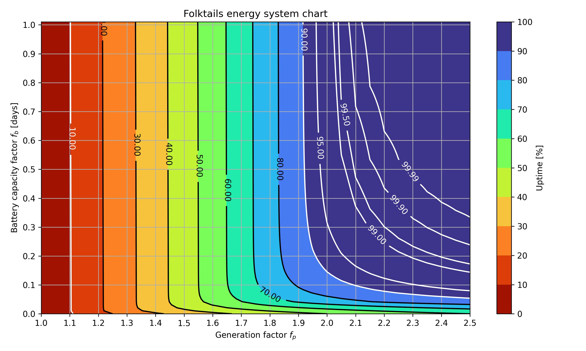

# Timberborn Folktails energy planning

[](https://www.python.org/) [](https://opensource.org/licenses/MIT)

This repository contains a model for the energy system of the Timberborn Folktails faction in the game Timberborn. The model is designed to help players optimize their energy production and consumption, taking into account the unique characteristics of wind distribution.

## Table of Contents

- [Usage](#usage)
- [Reproduction](#reproduction)
- [Discussions](#discussions)

## Usage



You have two parameters:
- *Generation factor* $f_p$ - a ratio between windmills **maximum** power generation and colony power consumption;
- *Battery capacity factor* $f_b$ - a ratio between batteries capacity and colony **daily** consumption (e.g. how long can your colony last using the batteries only).

You need to find the point on the chart that corresponds to your parameters. The chart shows isolines of uptime rate (in percentage) for different combinations of $f_p$ and $f_b$. The color bar indicates the uptime rate.

### Example
You have a field of 4 Large windmills that produce $400\cdot4=1600 \text{ hp}$ at amximum and a colony with energy consumption of $800 \text{ hp}$. Also you have a battery array that stores a half of daily consumption of the energy ($800 \cdot 12 = 9600 \text{ hph}$). You need to find the uptime rate of your energy system.

First, you need to calculate the generation factor and battery capacity factor:

$$f_p = \frac{1600}{800} = 2$$

your windmills produce twice the amount of power that your colony use. Then you need to calculate the battery capacity factor:
$$f_b = \frac{9600}{800 \cdot 24} = 0.5 \text{ days}.$$

Now you can find the point on the chart that corresponds to your parameters. The point is located at $f_p=2$ and $f_b=0.5$. The chart shows that the uptime rate is approximately $95\%$. This means that your energy system have the rate of failure less than 5% of the time.

All the math behind the model is provided in the `Model.ipynb` file.

## Reproduction

To reproduce the results, you need to install the required packages and run the script. The script will generate a chart with isolines of uptime rate for different combinations of generation factor and battery capacity factor.

```bash
pip install -r requirements.txt

jupyter notebook Model.ipynb
```

The chart will be saved in the `/results` folder as `chart.jpg`. You can change the parameters of the chart in the `Model.ipynb` file. 

It will take a few hours to generate the chart under the given parameters, so be patient. The script will use a GPU to speed up the process.

## Discussions

Should you have any questions or suggestions, feel free to open an [issue](https://github.com/Makkarik/Timberborn-folktails-energy/issues) or make a [pull request](https://github.com/Makkarik/Timberborn-folktails-energy/pulls) in the repository.


