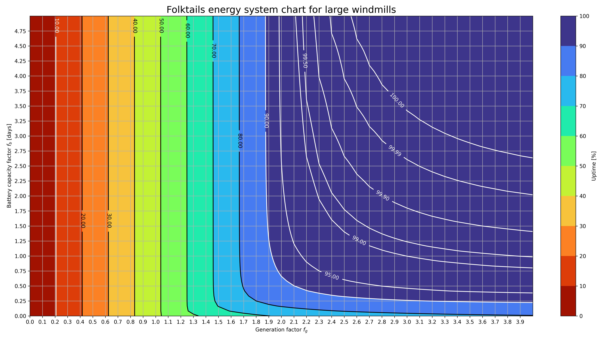
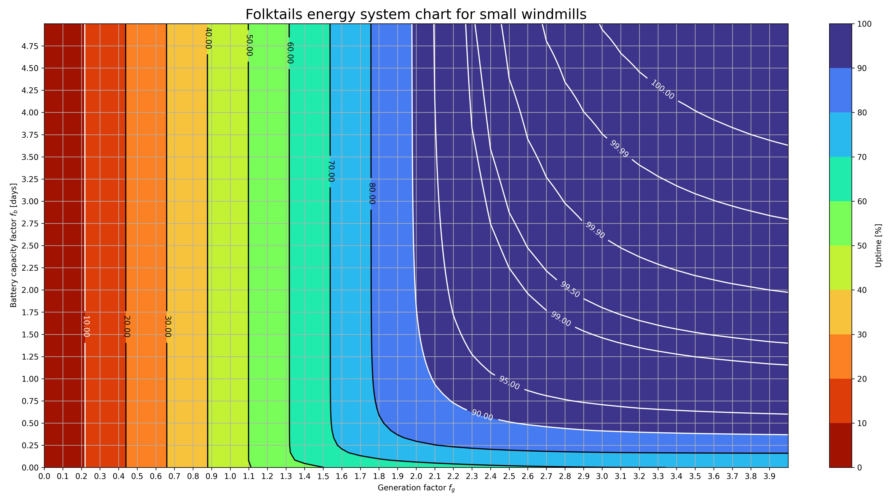

# Timberborn Folktails energy planning

[](https://colab.research.google.com/github/Makkarik/Timberborn-folktails-energy/blob/main/Model.ipynb)

This repository contains a model for the energy system of the Timberborn Folktails faction in the game Timberborn. The model is designed to help players optimize their energy production and consumption, taking into account the unique characteristics of wind distribution.

## Table of Contents

- [Usage](#usage)
- [Reproduction](#reproduction)
- [Discussions](#discussions)

## Usage

Firstly, you need to choose the type of windmill you are using: small or large. The upper chart shows the uptime rates for the system with small windmills. The lower one is for the large windmills.






Now you need to calculate two parameters:
- *Generation factor* $f_p$ - a ratio between windmills **maximum** power generation and colony power consumption;
- *Battery capacity factor* $f_b$ - a ratio between batteries capacity and colony **daily** consumption (e.g. how long can your colony last using the batteries only).

You need to find the point on the chart that corresponds to your parameters. The chart shows isolines of uptime rate (in percentage) for different combinations of $f_p$ and $f_b$. The color bar indicates the uptime rate.

### Example
You have a colony that consumes $2000 \text{ hp}$. You have 10 large windmills with maximum power generation of $400 \text{ hp}$ units each. Thus, the generation factor is 
$$f_g = \frac{10\cdot400}{2000} = 2.$$ 
The batteries have a capacity of $96000 \text{ hph}$, so the battery capacity factor is 
$$f_b = \frac{96000}{2000 \cdot 24} = 2 \text{ days}.$$

The lower chart shows that the uptime rate for $f_g = 2$ and $f_b = 2$ with large windmills is greater than $90\%$. Thus, you can be sure that the chance of the system failure is less than $10%$.

You can increase the robustenss of the system by either adding more windmills or batteries. The chart shows that it is cheaper to add windmills, as by adding one more windmill you increase the $f_g$ to $2.2$, thus increasing the uptime rate to $95\%$.

All the math behind the model is provided in the `Model.ipynb` file.

## Reproduction

To reproduce the results, you can just press Google Colab button above. It will open the `Model.ipynb` file in Google Colab, where you can run the code and generate the chart.

Alternatively, you can run the code locally. To do this, you need to install the required packages. You can do this by running the following command in your terminal:

```bash
pip install -r requirements.txt

jupyter notebook Model.ipynb
```

The chart will be saved in the `/results` folder as `chart.jpg`. You can change the parameters of the chart in the `Model.ipynb` file. 

It will take a few hours to generate the chart under the given parameters, so be patient. The script will use a GPU to speed up the process.

## Discussions

Should you have any questions or suggestions, feel free to open an [issue](https://github.com/Makkarik/Timberborn-folktails-energy/issues) or make a [pull request](https://github.com/Makkarik/Timberborn-folktails-energy/pulls) in the repository.
